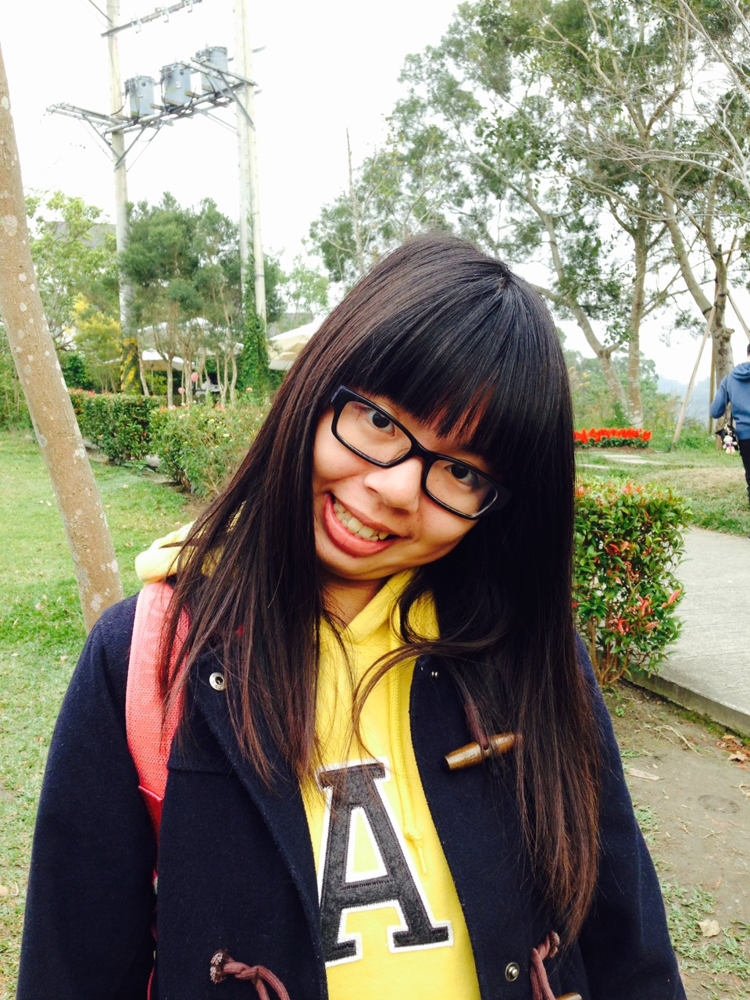
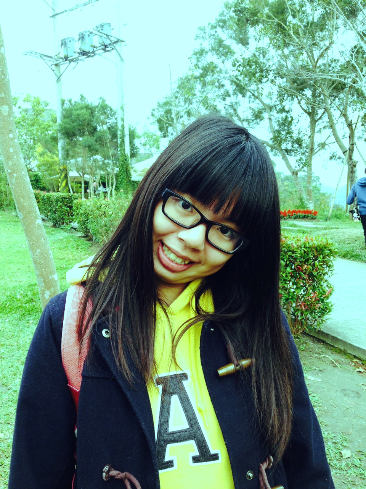
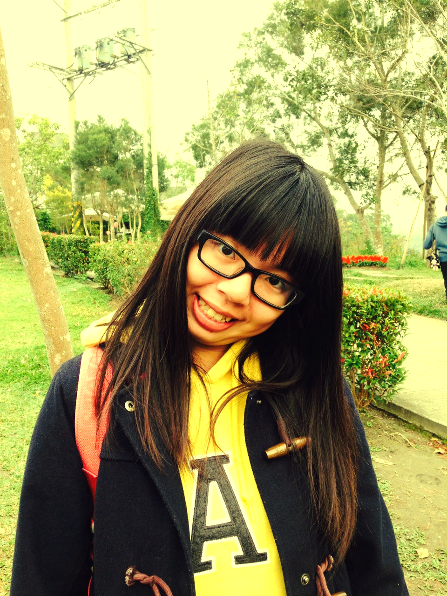

#Overview
* 用C++完成影像處理的工作：將圖片加上冷色系與暖色系濾鏡

#Implementation
* 可調整的數值部分：冷色或暖色(type)、調整程度(level)
```
std::cout << "type(cold:1,warm:2):";
std::cin >> type;
std::cout << "level(1~5):";
std::cin >> level;

level = level / 10;
a = 1 + level;
b = 1 - level;
```
藉由此部分，可選擇將照片調整為冷色系或暖色系，並決定其調色程度多寡。<br/>
a 與 b 則分別代表增加的倍率與減少的倍率。

* 冷色系
```
if (type == 1){
  pixptr[2] = pixptr[2] * b;

  if ((pixptr[1] * a)>255) pixptr[1] = 255;
	else pixptr[1] = pixptr[1] * a;

	if ((pixptr[0] * a)>255) pixptr[0] = 255;
	else pixptr[0] = pixptr[0] * a;
}
```
冷色系的部分，將紅色調低，藍色與綠色調高。

* 暖色系
```
else if (type == 2){
	if ((pixptr[2] * a) > 255) pixptr[2] = 255;
	else pixptr[2] = pixptr[2] * a;

	if ((pixptr[1] * a) > 255) pixptr[1] = 255;
	else pixptr[1] = pixptr[1] * a;

	pixptr[0] = pixptr[0] * b;
}
```
原先只將紅色調高，但經過嘗試之後發現畫面有點不如預期。<br/>
因此決定將綠色也調高，出來的畫面偏黃色，非常符合暖色系的想法。

#Disparity result
* origin:


* 冷色系


* 暖色系

